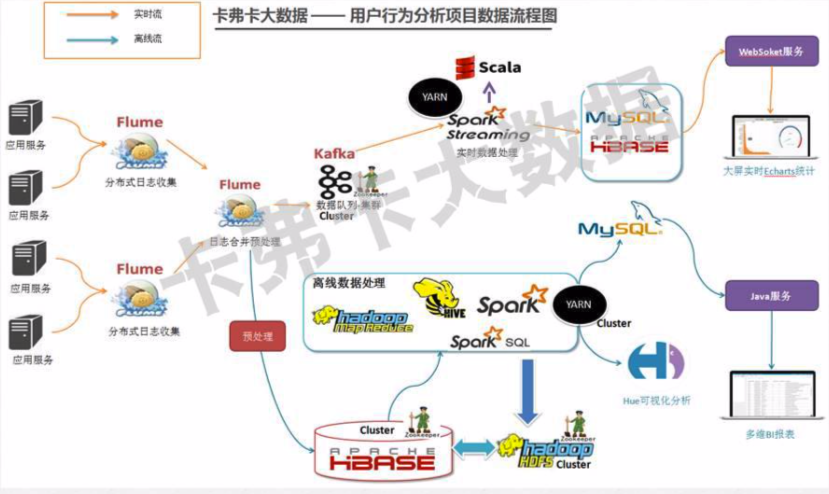

# 搜狗用户日志分析

开发环境：macos
集群软件环境：hadoop-2.7.2, java1.8.0_202, hbase-1.1.11, kafka_2.11-1.1.0, spark-2.2.3, zookeeper-3.4.12

## 框架



## 下载数据集

```
$ wget http://download.labs.sogou.com/dl/sogoulabdown/SogouQ/SogouQ.reduced.tar.gz  # 下载数据集合
$ tar xzvf SogouQ.reduced.tar.gz  # 解压数据集
$ iconv -f gb18030 -t utf8 SogouQ.reduced > sougou.log  # 数据集编码格式为gb2312(需使用gb18030格式，直接使用gb2312解析中途会出错)，为了需要转化为utf-8，
```

搜狗日志只截取了前100万条


## 运行命令


``` shell
$ bin/kafka-topics.sh --create --zookeeper header:2181,worker-1:2181,worker-2:2181 --replication-factor 2 --partitions 1 --topic weblogs  # kafka上创建topic
$ flume-ng agent --conf /opt/modules/apache-flume-1.7.0-bin/conf --conf-file /home/hadoop/sougou_log_analyze/src/log_hub/sougou_log_flume_1.conf -name a1 -Dflume.root.logger=INFO,console  # 启动汇总点

$ nohup python generate_log.py &  # 启动节点2生成日志
$ nohup python generate_log.py &  # 启动节点3生成日志
$ flume-ng agent --conf /opt/modules/apache-flume-1.7.0-bin/conf --conf-file /home/hadoop/sougou_log_analyze/src/log_hub/sougou_log_flume_2.conf -name a1 -Dflume.root.logger=INFO,console  # 启动采集点2
$ flume-ng agent --conf /opt/modules/apache-flume-1.7.0-bin/conf --conf-file /home/hadoop/sougou_log_analyze/src/log_hub/sougou_log_flume_3.conf -name a1 -Dflume.root.logger=INFO,console  # 启动采集点3

$ spark-submit --jars spark-streaming-kafka-0-8_2.11-2.2.0.jar --packages org.apache.spark:spark-streaming-kafka-0-8_2.11:2.2.0  main.py  # 运行sparkstream从kafka里消费数据。
```
